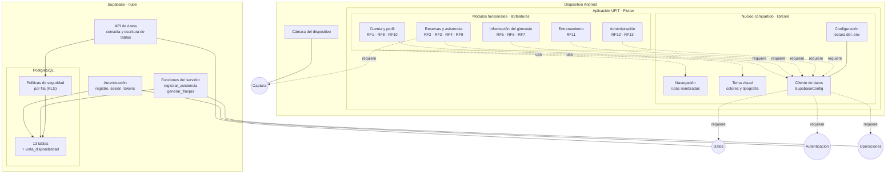

# Diagrama de componentes

Vista de la arquitectura de UFIT: qué piezas componen el sistema, qué ofrece cada una y de qué depende. Complementa el [modelo de datos](modelo-de-datos.md), que describe la estructura de la información; este documento describe la estructura del software.

Corresponde al estado del proyecto al 22 de septiembre de 2026.

---

## El diagrama

**Cómo leer el dibujo.** Las cajas son componentes. Los círculos son interfaces: lo que un componente ofrece al resto. La **línea continua** entre un componente y un círculo significa que ese componente **provee** esa interfaz. La **flecha punteada** significa que el componente **requiere** esa interfaz para funcionar.

Lo importante de esa distinción: un módulo que requiere una interfaz no sabe quién la implementa. El módulo de reservas pide "Datos"; no sabe que del otro lado hay PostgREST hablando con PostgreSQL. Si mañana se cambia Supabase por otra cosa, se reescribe el cliente de datos y los cinco módulos siguen igual.

---

## Los componentes

### Módulos funcionales — `lib/features`

Cinco componentes, uno por área del negocio, y cada uno con un único dueño en el equipo. Contienen las pantallas y la lógica de sus requerimientos.

| Componente | Requerimientos | Dueño |
|---|---|---|
| Cuenta y perfil | RF1, RF8, RF10 | David |
| Reservas y asistencia | RF2, RF3, RF4, RF9 | David |
| Información del gimnasio | RF5, RF6, RF7 | Sergio |
| Entrenamiento | RF11 | Sergio |
| Administración | RF12, RF13 | Sergio |

**No se comunican entre sí.** Un módulo que necesita datos de otro los pide a la base, no al módulo vecino. El panel de estadísticas (RF12) lee las reservas y asistencias desde la base, no le pregunta nada al módulo de reservas. Esa regla es la que permite que dos personas trabajen en paralelo sin bloquearse, y es la misma que se refleja en el reparto de carpetas del repositorio.

### Núcleo compartido — `lib/core`

Lo que usan todos y no pertenece a ninguno. Se modifica entre los dos, en la sesión conjunta de los sábados.

- **Navegación** — el mapa de rutas con nombre. Cada pantalla se alcanza por una constante, no por un texto escrito a mano.
- **Tema visual** — colores, tipografía y estilos. Ninguna pantalla define colores propios: cambiar la identidad visual es cambiar un archivo.
- **Cliente de datos** — el único punto por el que la app habla con Supabase. Todos los módulos pasan por aquí.
- **Configuración** — lee la URL y la clave del archivo `.env`, que no está en el repositorio.

### Cámara del dispositivo

Componente externo, del sistema operativo. El módulo de reservas lo necesita para leer el código QR en la entrada del gimnasio (RF4). Es la única dependencia de hardware del sistema, y es la razón por la que el prototipo final tiene que probarse en Android y no en el navegador.

### Supabase — la nube

Tres servicios sobre una sola base de datos:

- **Autenticación** — registro, inicio de sesión y emisión de los tokens que identifican a cada usuario en las siguientes peticiones. Es lo que da soporte al RF1.
- **API de datos** — traduce las peticiones de la app en consultas SQL. La app nunca escribe SQL: pide "las franjas de esta semana con cupos disponibles" y el servicio resuelve.
- **Funciones del servidor** — la lógica que no puede vivir en la app porque hay que confiar en ella. `registrar_asistencia()` valida el QR contra la franja y el estado de la reserva; `generar_franjas()` crea el horario.

### PostgreSQL

- **Las trece tablas** y la vista de disponibilidad, descritas en el [modelo de datos](modelo-de-datos.md).
- **Las políticas de seguridad por fila**, que son un componente en sí mismo y no un detalle: se ejecutan dentro de la base, antes de devolver cualquier dato, y son las que impiden que un usuario vea las reservas o las medidas corporales de otro.

---

## Por qué las políticas de seguridad están en la base y no en la app

Es la decisión de arquitectura que más conviene poder defender.

La clave publicable de Supabase viaja dentro de la aplicación instalada. Cualquiera que descompile el APK la obtiene y puede consultar la base directamente, saltándose por completo las pantallas. Si la única protección fuera código Flutter que dice "muéstrale solo sus reservas", esa protección se evapora en el momento en que alguien deja de usar la app para hablarle a la base de frente.

Poniendo las reglas dentro de PostgreSQL, la base misma rechaza la petición sin importar de dónde venga. Es la diferencia entre una puerta con llave y un letrero que dice "no pasar".

---

## Correspondencia con los requerimientos

| Requerimiento | Componentes que intervienen |
|---|---|
| RF1 Registro e inicio de sesión | Cuenta → Cliente de datos → Autenticación → `perfiles` |
| RF2 Reservas por franja | Reservas → Cliente → API de datos → `vista_disponibilidad`, `reservas` |
| RF3 Cancelación | Reservas → Cliente → API de datos → `reservas` |
| RF4 Asistencia por QR | Reservas → Cámara y Cliente → Funciones → `asistencias` |
| RF5 Catálogo | Gimnasio → Cliente → API de datos → `maquinas`, `ejercicios` |
| RF6 Normativa | Gimnasio → Cliente → API de datos → `normativa` |
| RF7 Instructores | Gimnasio → Cliente → API → `asignaciones_instructor` |
| RF8 Datos antropométricos | Cuenta → Cliente → API → `medidas_antropometricas` |
| RF9 Historial | Reservas → Cliente → API → `reservas`, `asistencias` |
| RF10 Datos personales | Cuenta → Cliente → API → `perfiles` |
| RF11 Rutinas | Entrenamiento → Cliente → API → `rutinas`, `rutina_ejercicios` |
| RF12 Estadísticas | Administración → Cliente → API → `reservas`, `asistencias` |
| RF13 Gestión de contenidos | Administración → Cliente → API → `maquinas`, `ejercicios`, `normativa` |

Los trece requerimientos pasan por el mismo cliente de datos. Ese componente es el cuello de botella del diseño a propósito: es un solo sitio donde poner el manejo de errores de red, los reintentos y el registro de fallos.
