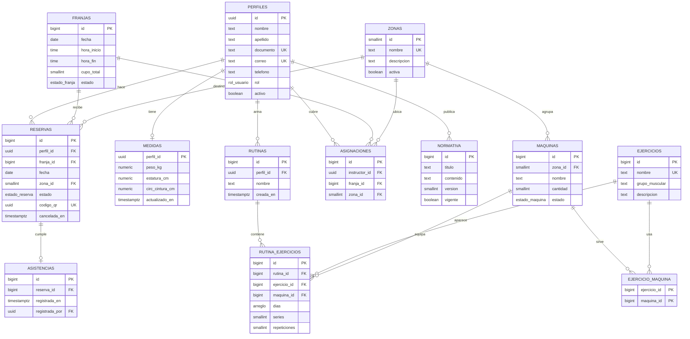

# Modelo de datos

**Estado: congelado el 21 de septiembre de 2026.**

Este documento y `supabase/schema.sql` son el contrato entre David y Sergio. Los nombres de tablas y columnas que están aquí son los que el código puede usar; ninguno de los dos los cambia por su cuenta.

Para cambiar algo: se abre un issue, se discute en la sesión del sábado y, si los dos están de acuerdo, se modifica el `schema.sql` en una rama `chore/` con su Pull Request. Un cambio silencioso rompe el módulo del otro sin que se note hasta la integración.

---

## Decisiones de diseño

Las cinco que definen la forma del modelo, con lo que implican.

**La reserva es de una franja y una zona, no de una máquina.** Es lo que dice la entrada del RF2 en el documento de la Entrega 1B: *"Fecha, franja horaria deseada, zona o grupo de máquinas"*. Las estadísticas de uso del RF12 se agrupan por zona. La máquina individual sí existe, pero vive en el catálogo (RF5) y en las rutinas (RF11), no en la reserva.

**El aforo de 75 es de la franja completa.** La zona queda como dato de la reserva para las estadísticas, sin cupo propio. Si cada zona tuviera su propio aforo, el calendario tendría que mostrar disponibilidad por zona y la pantalla se complica sin que ningún requerimiento lo pida.

**Las franjas existen como filas, generadas por adelantado.** Una fila por cada hora de cada día, de 6 a. m. a 9 p. m. Ocupa más espacio que un horario plantilla, pero hace que el calendario semanal sea una sola consulta y permite que el administrador cierre una franja puntual sin tocar el resto.

**El QR se genera por reserva y vence con la franja.** Cada reserva nace con un `codigo_qr` único. La función `registrar_asistencia()` valida que el código exista, que la reserva no esté cancelada, que la franja esté ocurriendo y que el ingreso no se haya registrado antes.

**Las medidas antropométricas son un registro que se actualiza, sin historial.** El RF8 pide registro y gestión, no evolución. Consecuencia aceptada: la app muestra la foto actual, no el progreso en el tiempo.

---

## Diagrama entidad-relación

> En el diagrama, `MEDIDAS` es `medidas_antropometricas` y `ASIGNACIONES` es `asignaciones_instructor`; se acortaron para que las cajas quepan. `reserva_id` en `ASISTENCIAS` además es única: una reserva tiene como mucho un ingreso.

---

## Las trece tablas

### `perfiles` — personas
Extiende `auth.users`, la tabla de cuentas que administra Supabase. Comparte su `id`, así que hay exactamente un perfil por cuenta; el correo y la contraseña los guarda Supabase, no nosotros.

Los tres roles viven aquí, en la columna `rol` (`usuario`, `instructor`, `administrador`). Van juntos porque comparten todos los campos y porque así las reservas, las rutinas y las medidas apuntan a una sola tabla. Un instructor también puede reservar.

### `zonas` — cardiovascular, fuerza, musculación
Tres filas fijas. Es a lo que apunta la reserva y por lo que se agrupan las estadísticas del RF12.

### `maquinas` — catálogo (RF5, RF13)
Cada máquina pertenece a una zona. `cantidad` dice cuántas unidades hay; `estado` permite marcarla en mantenimiento sin borrarla, para que el historial no quede colgando.

### `ejercicios` y `ejercicio_maquina` — catálogo (RF5, RF11)
Un ejercicio puede hacerse en varias máquinas y una máquina sirve para varios ejercicios. Esa relación muchos a muchos necesita su propia tabla: `ejercicio_maquina`.

### `franjas` — horario (RF2)
Una fila por hora y día, con `cupo_total` en 75. Se crean con `generar_franjas(desde, hasta)`. Cerrar una franja es cambiar su `estado` a `cerrada`, nunca borrarla: si tiene reservas asociadas, borrarla dejaría huecos en el historial.

### `reservas` — el centro del sistema (RF2, RF3, RF4)
Guarda quién, en qué franja, a qué zona, en qué estado y con qué código QR.

La columna `fecha` está duplicada de `franjas` a propósito, y una llave foránea compuesta `(franja_id, fecha)` garantiza que nunca se desincronice. Está ahí porque hace posible la regla de una reserva por día sin consultar otra tabla.

Cancelar no borra: cambia el `estado` a `cancelada` y llena `cancelada_en`.

### `asistencias` — ingreso real (RF4)
Una fila por ingreso efectivo, atada a una reserva. La diferencia entre reservas y asistencias es exactamente lo que el RF12 llama "asistencia efectiva frente a las reservas realizadas".

### `rutinas` y `rutina_ejercicios` — entrenamiento (RF11)
Máximo 3 rutinas por usuario, forzado por un disparador en la base. Cada línea de la rutina tiene ejercicio, máquina, días, series y repeticiones. Los días son un arreglo de números: `{1,3,5}` es lunes, miércoles y viernes.

### `medidas_antropometricas` — perfil físico (RF8)
Una fila por persona, con el `perfil_id` como llave primaria. Actualizar es sobrescribir.

### `normativa` — reglamento (RF6, RF13)
Las versiones se acumulan, pero solo una puede estar `vigente` a la vez, garantizado por un índice único parcial. Es la única tabla que se puede leer sin iniciar sesión, porque el RF6 dice que la normativa es accesible desde la barra de ayuda.

### `asignaciones_instructor` — agenda (RF7, RF13)
El administrador asigna un instructor a una franja y opcionalmente a una zona; el usuario consulta esa agenda.

---

## Reglas que hace cumplir la base

No están solo en el código de la app. Están en la base, así que se cumplen aunque alguien se equivoque programando:

| Regla | Cómo se hace cumplir |
|---|---|
| Una reserva viva por persona por día | Índice único parcial sobre `(perfil_id, fecha)`, ignorando las canceladas |
| La fecha de la reserva es la de su franja | Llave foránea compuesta `(franja_id, fecha)` |
| Máximo 3 rutinas por usuario | Disparador `rutinas_maximo_tres` |
| Los días de una rutina son del 1 al 7 | Restricción `check` sobre el arreglo |
| Una sola normativa vigente | Índice único parcial sobre `vigente` |
| Una cancelada tiene fecha de cancelación | Restricción `check` que amarra estado y fecha |
| Nadie ve reservas, rutinas ni medidas de otro | Políticas de seguridad a nivel de fila (RLS) |
| El QR solo sirve en su franja y una sola vez | Función `registrar_asistencia()` |

Esas políticas de RLS importan más de lo que parece: la clave pública de Supabase viaja dentro de la app, así que cualquiera que la extraiga puede consultar la base directamente. Sin RLS, podría leer las medidas corporales de todos los usuarios.

---

## Quién escribe cada tabla

Este es el reparto que evita que dos personas toquen lo mismo. "Lee" significa que ese módulo consulta la tabla pero nunca la modifica.

| Tabla | Escribe | Lee |
|---|---|---|
| `perfiles` | cuenta (David) | todos |
| `medidas_antropometricas` | cuenta (David) | — |
| `franjas` | admin (Sergio) | reservas (David) |
| `reservas` | reservas (David) | admin (Sergio) |
| `asistencias` | reservas (David) | admin (Sergio) |
| `zonas`, `maquinas`, `ejercicios`, `ejercicio_maquina` | admin (Sergio) | reservas (David), entrenamiento (Sergio) |
| `normativa` | admin (Sergio) | gimnasio (Sergio) |
| `asignaciones_instructor` | admin (Sergio) | gimnasio (Sergio) |
| `rutinas`, `rutina_ejercicios` | entrenamiento (Sergio) | — |

La única dependencia cruzada real sigue siendo la misma del plan de trabajo: el módulo de administración de Sergio lee las reservas y asistencias de David para el RF12. Por eso el modelo se congela.

---

## Cómo aplicarlo

1. Crear el proyecto en [supabase.com](https://supabase.com) — plan gratuito, región `East US` o la más cercana.
2. En el panel: **SQL Editor** → **New query** → pegar todo `supabase/schema.sql` → **Run**.
3. Guardar la URL del proyecto y la clave `anon` para configurarlas en la app. **La clave `service_role` no se usa nunca en la app ni se sube al repositorio.**
4. Verificar en **Table Editor** que aparezcan las trece tablas con sus datos semilla.

El script deja listas las zonas, nueve máquinas, siete ejercicios, la normativa y las franjas de las próximas cuatro semanas, para que las pantallas tengan algo que mostrar mientras se programan.

> Los proyectos gratuitos de Supabase se pausan tras siete días sin actividad. Se reactivan con un clic desde el panel; si eso pasa a mitad de una sesión de trabajo, no es un error de la app.

---

## Fuera del modelo

Cosas que deliberadamente **no** están, para que nadie las dé por hechas:

- Historial de medidas corporales.
- Aforo por zona.
- Reservas de máquinas individuales.
- Notificaciones o recordatorios.
- Pagos o membresías.
- Reservas recurrentes: el RF2 las menciona y la historia HU07 las cubre, pero son la primera candidata a recortar según el plan. Cuando se implementen, se resuelven creando varias filas en `reservas`, sin tabla nueva.
